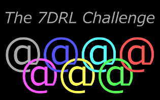
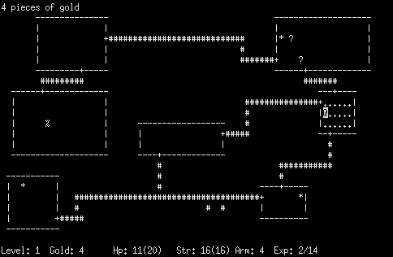
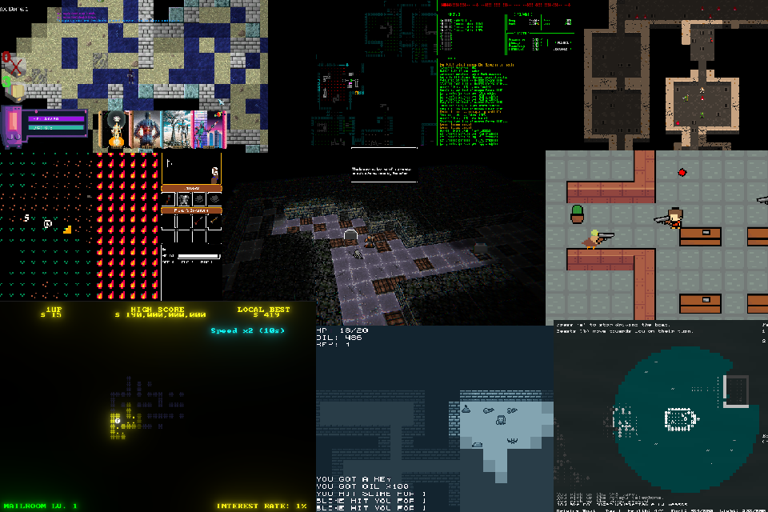
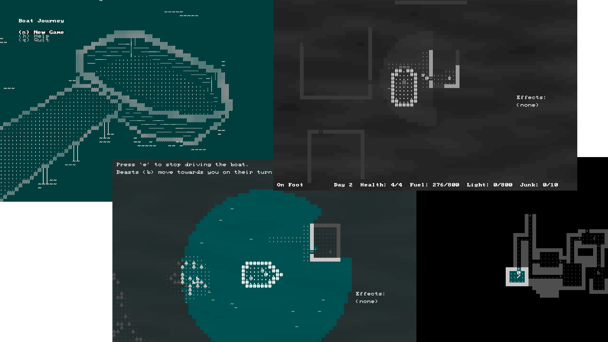
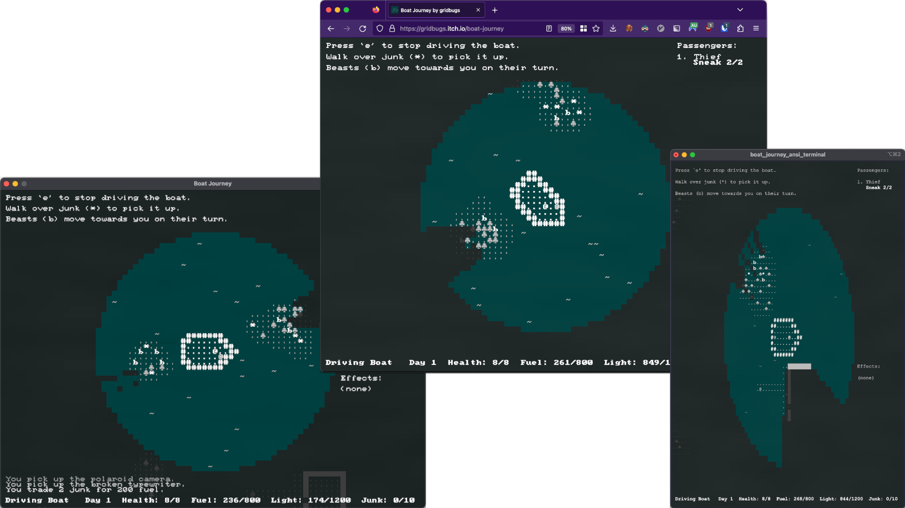
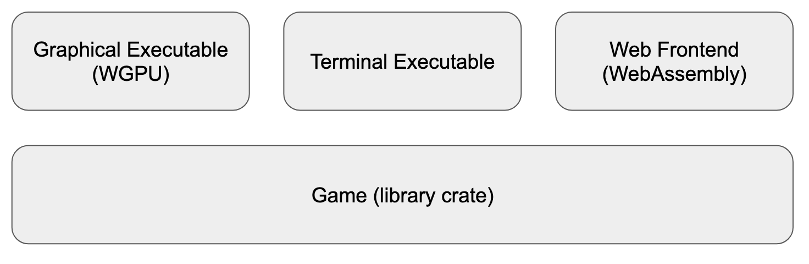

# **Making a Roguelike in 7 Days in Rust**

## Sydney Rust Meetup 2023-04-13

#### Stephen Sherratt (@gridbugs)

gridbugs.org
github.com/gridbugs
hachyderm.io/@gridbugs
gridbugs.itch.io

---



## What are roguelikes?

Games resembling the 1980 computer game Rogue

- procedurally-generated levels
- turn-based gameplay
- permadeath
- grid-based world
- RPG elements
- ASCII graphics

---



---



---

## Rust for game jams?

 - types save you from yourself
 - library support and gamedev community
 - long build times
 - fast executables
 - easy web assembly (wasm-bindgen and wasm-pack)

## Rest of the talk

 - easy cross-platform support and faster dev builds with `chargrid`
 - ad hoc state machines with linear witnesses

---



---




---

## Building WGPU exe after small change

```
$ cargo build --manifest-path wgpu/Cargo.toml
   Compiling boat_journey_game v0.1.0 (/home/s/src/boat-journey/game)
   Compiling boat_journey_app v0.1.0 (/home/s/src/boat-journey/app)
   Compiling boat_journey_native v0.1.0 (/home/s/src/boat-journey/native)
   Compiling boat_journey_wgpu v0.1.0 (/home/s/src/boat-journey/wgpu)
    Finished dev [unoptimized + debuginfo] target(s) in 6.29s
```

 - 6 second rebuild time is annoying when playtesting
 - the WGPU exe has 255 dependencies (at time of writing)

---

```
$ cargo build --manifest-path sdl2/Cargo.toml
   Compiling boat_journey_game v0.1.0 (/home/s/src/boat-journey/game)
   Compiling boat_journey_app v0.1.0 (/home/s/src/boat-journey/app)
   Compiling boat_journey_native v0.1.0 (/home/s/src/boat-journey/native)
   Compiling boat_journey_sdl2 v0.1.0 (/home/s/src/boat-journey/sdl2)
    Finished dev [unoptimized + debuginfo] target(s) in 2.40s
```

