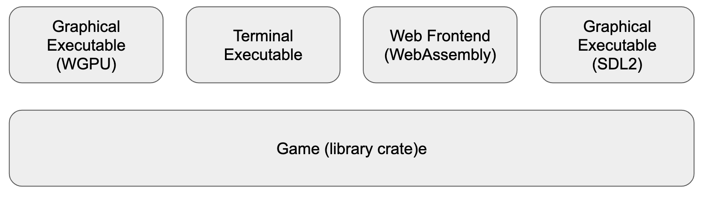
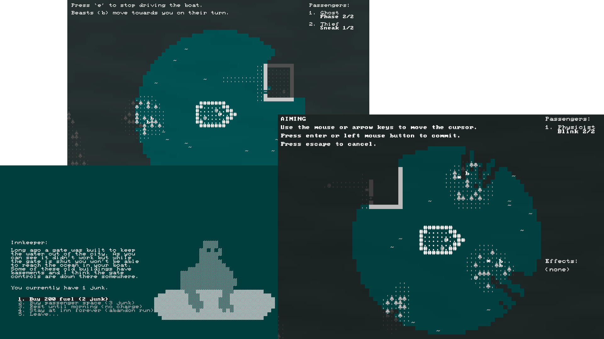
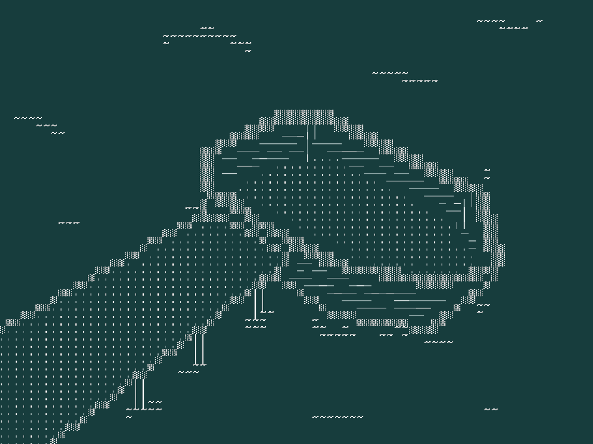

# **Making a Roguelike in 7 Days in Rust**

## Sydney Rust Meetup 2023-04-13

#### Stephen Sherratt (@gridbugs)

gridbugs.org
github.com/gridbugs
hachyderm.io/@gridbugs
gridbugs.itch.io

---


## What are roguelikes?

Games resembling the 1980 computer game Rogue

- procedurally-generated levels
- turn-based gameplay
- permadeath
- grid-based world
- RPG elements
- ASCII graphics

---


---


---

## Rust for game jams?

 - types save you from yourself
 - library support and gamedev community
 - long build times
 - fast executables
 - easy web assembly (wasm-bindgen and wasm-pack)

## Rest of the talk

 - easy cross-platform support and faster dev builds with `chargrid`
 - ad hoc state machines with linear witnesses

---


---


---

## Building WGPU exe after small change

 - most debugging is done on graphical exe

```
$ cargo build --manifest-path wgpu/Cargo.toml
   Compiling boat_journey_game v0.1.0 (/home/s/src/boat-journey/game)
   Compiling boat_journey_app v0.1.0 (/home/s/src/boat-journey/app)
   Compiling boat_journey_native v0.1.0 (/home/s/src/boat-journey/native)
   Compiling boat_journey_wgpu v0.1.0 (/home/s/src/boat-journey/wgpu)
    Finished dev [unoptimized + debuginfo] target(s) in 6.29s
```

 - 6 second rebuild time is annoying when playtesting
 - the WGPU exe has 255 dependencies on linux with vulkan backend

---



---

## Build SDL2 exe after small change

```
$ cargo build --manifest-path sdl2/Cargo.toml
   Compiling boat_journey_game v0.1.0 (/home/s/src/boat-journey/game)
   Compiling boat_journey_app v0.1.0 (/home/s/src/boat-journey/app)
   Compiling boat_journey_native v0.1.0 (/home/s/src/boat-journey/native)
   Compiling boat_journey_sdl2 v0.1.0 (/home/s/src/boat-journey/sdl2)
    Finished dev [unoptimized + debuginfo] target(s) in 2.40s
```

 - the SDL2 exe has 96 dependencies
 - requires SDL2 libraries to be installed/distributed
 - text anti-aliasing doesn't work properly and runtime performance is worse than WGPU exe
 - build times much faster on linux compared to WGPU exe

---

## Ad hoc state machines with linear witnesses

---



---

```rust
impl Game {

    pub fn move_player(&mut self, direction: Direction) { ... }

    pub fn use_ability(&mut self, ability_index: usize) { ... }

    pub fn commit_shop_menu_choice(&mut self, choice: Choice) { ... }

    pub fn commit_blink(&mut self, destination: Coord) { ... }
}
```
---

```rust
// witness types are public but have no public constructor
pub struct Playing(());
pub struct ShopMenu(());
pub struct AimingBlink(());

pub enum AnyWitness {
    Playing(Playing),
    ShopMenu(ShopMenu),
    AimingBlink(AimingBlink),
}

impl Game {
    // mutating methods consume a witness and produce a new witness representing state change

    pub fn move_player(&mut self, direction: Direction, wit: Playing) -> AnyWitness { ... }

    pub fn use_ability(&mut self, ability_index: usize, wit: Playing) -> AnyWitness { ... }

    pub fn commit_shop_menu_choice(&mut self, choice: Choice, wit: ShopMenu) -> Playing { ... }

    pub fn commit_blink(&mut self, destination: Coord, wit: AimingBlink) -> Playing { ... }
}
```

---



## Questions?

Play/download at [gridbugs.itch.io/boat-journey](https://gridbugs.itch.io/boat-journey)

Source at [github.com/gridbugs/boat-journey](https://github.com/gridbugs/boat-journey)

Devlog at [gridbugs.org/7drl2023-day1](https://www.gridbugs.org/7drl2023-day1/)
